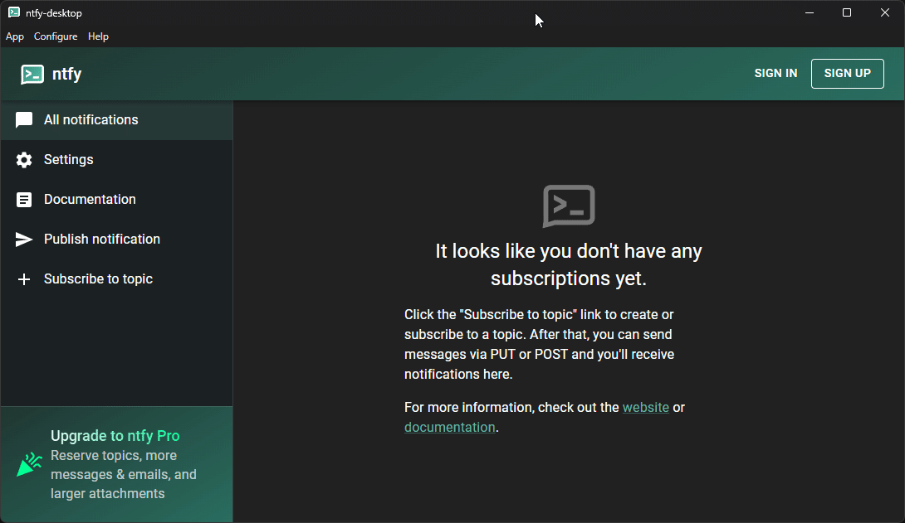

<div align="center">
<h6>Ntfy.sh desktop client for Windows, Linux, and MacOSX</h6>
<h1>♾️ ntfy-desktop ♾️</h1>

<br />

<p>A ntfy.sh desktop client built with Electron which supports Windows, Linux, and MacOSX. This client rests in your taskbar tray and allows you to receive push notifications to your desktop without requiring you to leave your browser open.</p>

<p float="left">
  
   
</p>

<p float="left">
  
   
</p>

<p float="left">
  
   
</p>

<br />

</div>

<div align="center">

<!-- prettier-ignore-start -->
[![Version][github-version-img]][github-version-uri]
[![Build Status][github-build-img]][github-build-uri]
[![Build Status][github-tests-img]][github-tests-uri]
[![Downloads][github-downloads-img]][github-downloads-uri]
[![Size][github-size-img]][github-size-img]
[![Last Commit][github-commit-img]][github-commit-img]
[![Contributors][contribs-all-img]](#contributors-)
<!-- prettier-ignore-end -->

</div>

<br />

---

<br />

- [About](#about)
  - [What is Ntfy](#what-is-ntfy)
  - [Ntfy Desktop Features](#ntfy-desktop-features)
  - [Self-hosted vs Ntfy.sh](#self-hosted-vs-ntfysh)
- [Usage](#usage)
  - [Key Binds](#key-binds)
  - [CLI Arguments](#cli-arguments)
- [Build](#build)
  - [Method: Build Script](#method-build-script)
    - [Windows](#windows)
    - [Linux](#linux)
    - [MacOSX](#macosx)
  - [Method: Package.json Command](#method-packagejson-command)
    - [Summary](#summary)
    - [Windows](#windows-1)
    - [Linux](#linux-1)
    - [MacOSX](#macosx-1)
- [Tests](#tests)
  - [Github Workflow](#github-workflow)
  - [Manual Test](#manual-test)
    - [Playwright Tests](#playwright-tests)
    - [Vitest Tests](#vitest-tests)
- [Linting](#linting)
- [Signed Releases](#signed-releases)
  - [Validate .Sig](#validate-sig)
  - [Validate SHA256SUM](#validate-sha256sum)
  - [Validate SHA1SUM](#validate-sha1sum)
- [Dependencies](#dependencies)
- [Contributors ✨](#contributors-)


<br />

---

<br />

# About

This project allows you to access the official free / paid notification service [ntfy.sh](https://ntfy.sh/), or your own self-hosted version of ntfy from within a desktop application which utilizes Electron as the wrapper.

<br />

## What is Ntfy

[ntfy.sh](https://ntfy/) (pronounced "notify") is a simple HTTP-based pub-sub notification service. With [ntfy](https://ntfy/), you can send notifications to your phone or desktop via scripts from any computer, without having to sign up or pay any fees. If you'd like to run your own instance of the service, you can easily do so since ntfy is open source.

To install Ntfy on your system, visit the following links:

<div align="center">

[](https://github.com/binwiederhier/ntfy/releases) [](https://docs.ntfy.sh/install/)

</div>

<br />

## Ntfy Desktop Features

- Supports both the official ntfy.sh website / service or your own self-hosted instance
  - To self-host, you must install Ntfy server on a local machine.
  - View docs at https://docs.ntfy.sh/install/
- Two modes for minimizing app, configure in settings
  1. Close button exits app completely; OR
  2. Close button sends app to tray. Right-click tray icon to quit / show app
- Start app minimized
- Shortcut key-binds
  - Can disable the keyboard shortcuts
- Receive push notifications from ntfy server to desktop
  - Ability to adjust polling rate
  - Modify `datetime` format
  - Notifications (two options):
    1. Persistent (sticky) notifications which require user interaction to clear
    2. Timed notifications which disappear after X seconds
  - Topic filtering & support
    - Defaults: `news, announcements`
- Supports Ntfy API token
- Taskbar unread message count / count
- Includes [command-line arguments](#cli-arguments)

<br />
<br />

## Self-hosted vs Ntfy.sh

To use this desktop client, you will be required to either have an Ntfy.sh account, or you must host your own instance of the Ntfy.sh server to pull notifications from. 

You can install your own self-hosted copy of Ntfy server from:

- https://github.com/binwiederhier/ntfy/releases

<br />

Be aware that the official [ntfy.sh](https://ntfy/) website will **rate-limit** users who have not purchased a paid package. Out of box, this ntfy-desktop client polls for new notifications every `30 seconds`; if you are on the free plan and decrease this timer in the desktop client settings, you will get an error saying that you have gone over your rate-limit. 

<br />

If you are self-hosting your own copy of Ntfy, you must open the Ntfy Desktop client, click the top menu item **App**, go down to **Settings** and then click **Instance**. You must set your instance URL to your personal self-hosted instance. To set your instance URL back to the official ntfy server, clear the URL box and save.

<p align="center"></p>

<br />

You can set the polling rate lower without any limitations or rate limits:

<p align="center"></p>


<br />

---

<br />

# Usage

This section explains how to use ntfy-desktop once you have it ready to go on your system.

<br />

## Key Binds
The following keybinds can be used within ntfy-desktop:

<br />

| Key(s) | Description |
| --- | --- |
| `CTRL + R` | Refresh page |
| `CTRL + Q` | Quit application |
| `CTRL + M` | Minimize to tray |
| `CTRL + =` | Zoom in |
| `CTRL + -` | Zoom out |
| `CTRL + 0` | Zoom reset |
| `CTRL + SHIFT + I` | Developer tools |
| `F12` | Developer tools |
| `CTRL + G` | Show General settings window |
| `CTRL + I` | Show URL / Instance window |
| `CTRL + T` | Show API Token settings window |
| `CTRL + SHIFT + T` | Show Topics settings window |
| `CTRL + N` | Show Notifications settings window |

<br />

> [!NOTE]
> Hotkeys are disabled by default. To enable hotkeys, select **App** in the top menu, and select **Settings** -> **General**.
> 
> Enable `Allow usage of hotkeys to navigate`

<br />
<br />

## CLI Arguments

This client allows you to utilize the following command-line arguments with ntfy-desktop:

<br />

| Argument | Description | Available as setting |
| --- | --- | --- |
| `--hidden` | Start app hidden in tray, suitable for auto-starting on system login/boot | ✅ |
| `--hotkey` | Start app with hotkeys enabled | ✅ |
| `--quit` | Top-right close button will completely exit app instead of minimize to tray | ✅ |
| `--dev` | Start app with developer tools in `App` menu | ✅ |

<br />

If you are running ntfy-desktop from node, you can pass arguments using the following example:

```shell ignore
npm run start -- --hidden --hotkey
```

<br />

If using the pre-built binaries, pass arguments by opening your terminal / command prompt, and passing the arguments using:

```shell
# Windows
ntfy-desktop-win32-x64/ntfy-desktop.exe --hidden --hotkey

# Linux
ntfy-desktop-linux-x64/ntfy-desktop --hidden --hotkey

# MacOS
ntfy-desktop-darwin-x64/ntfy-desktop.app/Contents/MacOS/ntfy-desktop --hidden --hotkey
```

<br />

---

<br />

# Build

There are numerous ways to build this application. 

<br />

## Method: Build Script

This method makes use of the `build.bat` and `build.sh` scripts provided in this repository. Find your operating system below and follow the instructions:

- [Windows](#windows)
- [Linux](#linux)
- [MacOSX](#macosx)

<br />

### Windows

Install NodeJS with NPM by going to the following URL. Make sure to select your current operating system at the top:

- https://nodejs.org/en/download

<br />

Next, run the following commands in Powershell or Windows Command Prompt:

```shell
# Clone ntfy-desktop repo, make sure you are in an EMPTY folder:
mkdir ntfy-desktop && cd ntfy-desktop/
git clone https://github.com/aetherinox/ntfy-desktop.git .

# install npm packages
npm install
npm install -g electron

# build ntfy
./build.bat
```

<br />
<br />

### Linux

Run the following commands to install NodeJS + NPM, and then Ntfy Desktop:

```shell
# Install packages
sudo apt update
sudo apt install git nodejs npm wine64

# create the needed folders
mkdir ntfy-desktop && cd ntfy-desktop/

# clone repo
git clone https://github.com/aetherinox/ntfy-desktop.git .

# install npm packages
npm install
npm install -g electron-packager

# set wine symlink
sudo ln -s /usr/bin/wine /usr/bin/wine64

# change permissions
sudo chmod +x build.sh

# build ntfy
./build.sh
```

<br />
<br />

### MacOSX

Install NodeJS with NPM by going to the following URL. Make sure to select your current operating system at the top.

<br />

To install **node / npm**, download from:
- https://nodejs.org/en/download

<br />

To install **Git** on your system:

- https://git-scm.com/downloads/mac

<br />

Open your Terminal app and run the following commands:

<br />

```shell
# install git
brew install git

# install wine
brew install --cask wine-stable

# create the needed folders
mkdir ntfy-desktop && cd ntfy-desktop/

# clone repo
git clone https://github.com/aetherinox/ntfy-desktop.git .

# install npm packages
npm install
npm install -g electron-packager

# set wine symlink
sudo ln -s /usr/bin/wine /usr/bin/wine64

# change permissions
sudo chmod +x build.sh

# build ntfy
./build.sh
```

<br />
<br />

## Method: Package.json Command

You can also build your own copy of ntfy-desktop by executing the included `package.json` run commands.

- [Windows](#windows-1)
- [Linux](#linux-1)
- [MacOSX](#macosx-1)

<br />

### Summary

To run the `npm` commands, you must install NodeJS and NPM on your system. To install them, visit: 

- https://nodejs.org/en/download

<br />

The `package.json` includes the commands listed below. Because the build commands have dynamic variables; you must run the command based on what operating system you are building from.

If you are building ntfy-desktop from a **Windows** machine:

- `npm run build:win:windows`
- `npm run build:win:linux`
- `npm run build:win:mac`

<br />

If you are building ntfy-desktop from a **Linux** or **MacOS** machine:

- `npm run build:lin:windows`
- `npm run build:lin:linux`
- `npm run build:lin:mac`

<br />
<br />

### Windows

Install NodeJS with NPM by going to the following URL. Make sure to select your current operating system at the top:

- https://nodejs.org/en/download

<br />

Next, run the following commands in Powershell or Windows Command Prompt:

```shell
# create the needed folders
mkdir ntfy-desktop && cd ntfy-desktop/

# clone repo
git clone https://github.com/aetherinox/ntfy-desktop.git .

# install npm packages
npm install
npm install -g electron-packager

# build ntfy-desktop from Windows to Windows machine
npm run build:win:windows

# build ntfy-desktop from Windows to Linux machine
npm run build:lin:windows
```

<br >
<br >

### Linux

Run the following commands to install NodeJS + NPM, and then Ntfy Desktop:

```shell
# Install NodeJS and NPM
sudo apt update
sudo apt install git nodejs npm wine64

# create the needed folders
mkdir ntfy-desktop && cd ntfy-desktop/

# clone repo
git clone https://github.com/aetherinox/ntfy-desktop.git .

# install npm packages
npm install
npm install -g electron-packager

# set wine symlink
sudo ln -s /usr/bin/wine /usr/bin/wine64

# build ntfy-desktop from Linux to Windows machine
npm run build:lin:linux

# build ntfy-desktop from Linux to Linux machine
npm run build:lin:windows
```

<br />
<br />

### MacOSX

Install NodeJS with NPM by going to the following URL. Make sure to select your current operating system at the top:

- https://nodejs.org/en/download

<br />

Install **Git** on your system next:

- https://git-scm.com/downloads/mac

<br />

Open your Terminal app and run the following commands:

```shell
# Install NodeJS and NPM
sudo apt update
sudo apt install git nodejs npm wine64

# create the needed folders
mkdir ntfy-desktop && cd ntfy-desktop/

# clone repo
git clone https://github.com/aetherinox/ntfy-desktop.git .

# install npm packages
npm install
npm install -g electron-packager

# set wine symlink
sudo ln -s /usr/bin/wine /usr/bin/wine64

# build ntfy-desktop from Windows to MacOS machine
npm run build:win:mac

# build ntfy-desktop from Linux toL MacOS machine
npm run build:lin:mac
```

<br />

---

<br />

# Tests

This repository contains tests in order to test the functionality of this project. We utilize a Github workflow to handle the automation, however, you can run the tests locally.

<br />

In order to run these tests, you must have some dependencies installed on your system or runner:

```shell
sudo apt install xvfb -y
npm install
npx playwright install-deps
```

<br />

If you do not run the command `playwright install-deps`; then you will need to install all of the dependencies manually with the command:

```shell
sudo apt install xvfb -y
sudo apt-get install libasound2 libxslt-dev woff2 libevent-dev libopus0 \
  libopus-dev libwebpdemux2 libharfbuzz-dev libharfbuzz0b libwebp-dev \
  libenchant-2-dev libsecret-1-0 libsecret-1-dev libglib2.0-dev libhyphen0 \
  libglfw3-dev libgles2-mesa-dev libudev1 libevdev2 libgles2-mesa yasm \
  libudev1 libudev-dev libgudev-1.0-0 libx264-dev libgconf-2-4 libatk1.0-0 \
  libatk-bridge2.0-0 libgdk-pixbuf2.0-0 libgtk-3-0 libgbm-dev libnss3-dev \
  libxss-dev -y
npx playwright install
```

<br />

## Github Workflow

You can fork this repository and run the included Github workflows
- https://github.com/Aetherinox/ntfy-desktop/blob/f794bb835cb68a2b6da74d9161e7432c673179ea/.github/workflows/npm-tests.yml

<br />

In order for the workflow to work, your Github or self-hosted runner must have numerous dependencies installed. Ensure you do not remove the `npm install` and `apt install` commands from the workflow; otherwise the tests will fail.

<br />

## Manual Test

You can also run the included tests manually without a Github workflow with the instructions below.

<br />

### Playwright Tests

These tests specifically check the Electron app itself. They will attempt to open ntfy-desktop and make sure the application is in working order. These tests do NOT test the back-end code of the app. 

```shell
cd ./src
npm run test
```

<br />

You should see numerous windows open and multiple copies of Ntfy Desktop start up. This is normal, and is the test checking out the functionality of the application.

<br />

If you want to run the tests from a CI without having a GUI available to see the tests; you can run the command:

```shell
xvfb-run --auto-servernum \
  --server-args="-screen 0 1280x960x24" npx playwright test \
  --trace on
```

<br />

If you want to run the tests, while having Electron running in debug / verbose mode; run the command:

```shell
DISPLAY=:0 DEBUG=pw:browser xvfb-run \
  --auto-servernum \
  --server-args="-screen 0 1280x960x24" npx playwright test \
  --trace on
```

<br />

The tests should show something similar to the following:

```console
[chromium] › tests/main.spec.js:65:1 › ✅ ensure interface can fully load
✅ Open New Window: About
[webkit] › tests/main.spec.js:65:1 › ✅ ensure interface can fully load
✅ Open New Window: About
[chromium] › tests/main.spec.js:65:1 › ✅ ensure interface can fully load
✅ Saved screenshot: test-results/fullload_1749458422355.png
[webkit] › tests/main.spec.js:65:1 › ✅ ensure interface can fully load
[SubscriptionManager] No browser subscription currently exists, so web push was never enabled or the notification permission was removed. Skipping.
✅ Saved screenshot: test-results/fullload_1749458422373.png
[firefox] › tests/main.spec.js:143:1 › ✅ fail to sign into invalid account
ntfy
[chromium] › tests/main.spec.js:143:1 › ✅ fail to sign into invalid account
ntfy
[webkit] › tests/main.spec.js:143:1 › ✅ fail to sign into invalid account
ntfy
  9 passed (15.3s)

To open last HTML report run:

  npx playwright show-report
```

<br />
<br />

### Vitest Tests

These tests check the back-end functionality of the app, including a lot of the functions that the source code comes with.

```shell
cd ./src
npm run test:unit:run
```

<br />

The results for the tests will be printed in your terminal / command prompt.

```shell
 RUN  v3.2.4 ntfy-desktop/src

 ✓ tests/storage.test.js (23 tests) 17ms
 ✓ tests/utils.test.js (26 tests) 31ms
 ✓ tests/logging.test.js (8 tests) 28ms

 Test Files  3 passed (3)
      Tests  57 passed (57)
   Start at  10:19:17
   Duration  577ms (transform 158ms, setup 0ms, collect 427ms, tests 76ms, environment 1ms, prepare 377ms)
```

<br />

---

<br />

# Linting

This node package comes with ESlint, and a set of rules which should be followed. If you have intentions of creating new features and contributing to this repository; you must follow these linter rules. You can check the current status of your code by running:

```shell
cd ./src
npm run lint
```

<br />

Any failures will be reported in console:

```shell
ntfy-desktop\src\tests\storage.test.js
    1:74   error  Expected linebreaks to be 'LF' but found 'CRLF'  @stylistic/linebreak-style
    2:21   error  Expected linebreaks to be 'LF' but found 'CRLF'  @stylistic/linebreak-style
    3:25   error  Expected linebreaks to be 'LF' but found 'CRLF'  @stylistic/linebreak-style
    4:21   error  Expected linebreaks to be 'LF' but found 'CRLF'  @stylistic/linebreak-style
    5:32   error  Expected linebreaks to be 'LF' but found 'CRLF'  @stylistic/linebreak-style
    6:1    error  Expected linebreaks to be 'LF' but found 'CRLF'  @stylistic/linebreak-style
    7:3    error  Expected linebreaks to be 'LF' but found 'CRLF'  @stylistic/linebreak-style
    8:29   error  Expected linebreaks to be 'LF' but found 'CRLF'  @stylistic/linebreak-style
    6:14   error  A space is required after '['                    @stylistic/array-bracket-spacing
    6:29   error  A space is required before ']'                   @stylistic/array-bracket-spacing
```

<br />

You must fix these before submitting a contribution. You can opt to automatically fix errors by running the command:

```shell
npm run lint:fix
```

<br />

> [!WARNING]
> Opting to automatically fix linting errors may result in mis-aligned brackets. Make sure these are fixed before submitting any pull requests.

<br />

---

<br />

# Signed Releases

These steps allow you to validate the files `sha256sum.txt.asc`, `sha1sum.txt.asc`, and `sha256sum.sig` which we provide with every release.

Validating these files helps ensure that the actual .zip or binary files you have downloaded indeed came from the real developer. Before you start reading the sections below; ensure you have the following packages installed:

- GPG
- sha1sum
- sha256sum

<br />

You can install these by running the commands:

```shell
# Ubuntu / Debian Systems
sudo apt update
sudo apt install gpg gnupg sha1sum sha256sum

# Fedora / Redhat
(yum | or | dnf ) install gpg gnupg
```

<br />

## Validate .Sig

Each release includes two `.sig` files; these are known as a GPG **Detached Signature**.

- sha1sum.sig
- sha256sum.sig

<br />

To validate that these signatures are good, download each of the files to your local machine:

```shell
# sha1sum
wget https://github.com/Aetherinox/ntfy-desktop/releases/download/2.1.1/sha1sum.sig

# sha256sum
wget https://github.com/Aetherinox/ntfy-desktop/releases/download/2.1.1/sha256sum.sig
```

<br />

Next, you will need the two associated files:

- sha1sum.txt.asc
- sha256sum.txt.asc

<br />

To download these, run the commands:

```shell
# sha1sum.txt.asc
wget https://github.com/Aetherinox/ntfy-desktop/releases/download/2.1.1/sha1sum.txt.asc

# sha256sum.txt.asc
wget https://github.com/Aetherinox/ntfy-desktop/releases/download/2.1.1/sha256sum.txt.asc
```

<br />

Now we can validate that these files indeed came from the original developer; run the command:

```shell
gpg --verify sha1sum.sig sha1sum.txt.asc
```

<br />

You should see the output:

```shell
gpg:                using RSA key 6921C2D3F6AE1188B7721C72F397BC89486A29A6
gpg: Good signature from "Binary Ninja (RSA 4096) <thebinaryninja@proton.me>" [unknown]
Primary key fingerprint: E8BA 8C94 B334 1673 0D8C  05C2 5769 7A1C BA63 B9FE
     Subkey fingerprint: 6921 C2D3 F6AE 1188 B772  1C72 F397 BC89 486A 29A6
```

<br />

Now validate the `sha256sum.sig` with the `sha256sum.txt.asc`:

```shell
gpg --verify sha256sum.sig sha256sum.txt.asc
```

<br />

You should see the output:

```shell
gpg:                using RSA key 6921C2D3F6AE1188B7721C72F397BC89486A29A6
gpg: Good signature from "Binary Ninja (RSA 4096) <thebinaryninja@proton.me>" [unknown]
Primary key fingerprint: E8BA 8C94 B334 1673 0D8C  05C2 5769 7A1C BA63 B9FE
     Subkey fingerprint: 6921 C2D3 F6AE 1188 B772  1C72 F397 BC89 486A 29A6
```

<br />

If you get the above results; you have validated the signature files.

<br />

<br />

## Validate SHA256SUM

This section explains how you can validate the downloaded `.zip` files and see if they are indeed authentic from the original developer. Before you can validate these files, you need to download the public GPG key we use when we sign releases. You can download it by running the following command:

```shell
curl -s https://github.com/BinaryServ.gpg | gpg --import
```

<br />

Download the `sha256sum.txt.asc` and validate the file itself:

```shell
wget https://github.com/Aetherinox/ntfy-desktop/releases/download/2.1.1/sha256sum.txt.asc

gpg --verify sha256sum.txt.asc
```

<br />

You should see the following. The value `6921C2D3F6AE1188B7721C72F397BC89486A29A6` is the key's fingerprint.

```shell
gpg: Signature made Mon 01 Jun 2025 00:00:00 UTC
gpg:                using RSA key 6921C2D3F6AE1188B7721C72F397BC89486A29A6
gpg: Good signature from "Binary Ninja (RSA 4096) <thebinaryninja@proton.me>" [ultimate]
```

<br />

You can view your existing GPG key fingerprints by running:

```shell
gpg --list-keys --keyid-format=long --fingerprint --with-fingerprint
```

<br />

This will allow you to see where the `692XXXXX` value comes from:

```shell
pub   rsa4096 2025-04-21 [C]
      E8BA 8C94 B334 1673 0D8C  05C2 5769 7A1C BA63 B9FE
uid           [ unknown] Binary Ninja (RSA 4096) <thebinaryninja@proton.me>
sub   rsa4096 2025-04-21 [S]
 >>>> 6921 C2D3 F6AE 1188 B772  1C72 F397 BC89 486A 29A6
sub   rsa4096 2025-04-21 [E]
      25E9 AFEC C12F 2072 AA6E  D5AB B077 63D0 A12F 0ED8
sub   rsa4096 2025-04-21 [A]
      AD79 A1EA CE17 962F B4ED  B30A DBA8 EA76 62FC 54E2
```

<br />

Next, download the `sha256sum.sig`

```shell
wget https://github.com/Aetherinox/ntfy-desktop/releases/download/2.1.1/sha256sum.sig
```

<br />

To validate the `.sig` file and your `sha256sum` file, run the command:

```shell
gpg --verify sha256sum.sig sha256sum.txt.asc
```

<br />

You should see:

```shell
gpg:                using RSA key 6921C2D3F6AE1188B7721C72F397BC89486A29A6
gpg: Good signature from "Binary Ninja (RSA 4096) <thebinaryninja@proton.me>" [unknown]
Primary key fingerprint: E8BA 8C94 B334 1673 0D8C  05C2 5769 7A1C BA63 B9FE
     Subkey fingerprint: 6921 C2D3 F6AE 1188 B772  1C72 F397 BC89 486A 29A6
```

<br />

You can now validate the `sha256sum.txt.asc` file against the files you have downloaded from our repository. In order to verify that the files are legit, you must download them from the [Releases](https://github.com/Aetherinox/ntfy-desktop/releases) page. They end with the extension `.zip`. You can also download them using `wget`. Make sure you download the zip files to the same folder where you downloaded the `sha256sum.txt.asc` and `sha256sum.sig`

```shell
# Download ntfy-desktop-2.1.1-darwin-amd64.zip
wget \
  https://github.com/Aetherinox/ntfy-desktop/releases/download/2.1.1/ntfy-desktop-2.1.1-darwin-amd64.zip

# Download ntfy-desktop-2.1.1-darwin-arm64.zip
wget \
  https://github.com/Aetherinox/ntfy-desktop/releases/download/2.1.1/ntfy-desktop-2.1.1-darwin-arm64.zip

# Download ntfy-desktop-2.1.1-linux-amd64.zip
wget \
  https://github.com/Aetherinox/ntfy-desktop/releases/download/2.1.1/ntfy-desktop-2.1.1-linux-amd64.zip

# Download ntfy-desktop-2.1.1-linux-arm64.zip
wget \
  https://github.com/Aetherinox/ntfy-desktop/releases/download/2.1.1/ntfy-desktop-2.1.1-linux-arm64.zip

# Download ntfy-desktop-2.1.1-linux-armv7l.zip
wget \
  https://github.com/Aetherinox/ntfy-desktop/releases/download/2.1.1/ntfy-desktop-2.1.1-linux-armv7l.zip

# Download ntfy-desktop-2.1.1-win32-amd64.zip
wget \
  https://github.com/Aetherinox/ntfy-desktop/releases/download/2.1.1/ntfy-desktop-2.1.1-win32-amd64.zip

# Download ntfy-desktop-2.1.1-win32-arm64.zip
wget \
  https://github.com/Aetherinox/ntfy-desktop/releases/download/2.1.1/ntfy-desktop-2.1.1-win32-arm64.zip

# Download ntfy-desktop-2.1.1-win32-ia32.zip
wget \
  https://github.com/Aetherinox/ntfy-desktop/releases/download/2.1.1/ntfy-desktop-2.1.1-win32-ia32.zip
```

<br />

Next, extract the hashes from the hash digest `sha256sum.txt.asc` file by running the command:

```shell
gpg --output sha256sum.txt --verify sha256sum.txt.asc
```

<br />

The command above will create a new file called `sha256sum.txt`, now run that file with the program `sha256sum`:

```shell
sha256sum --check sha256sum.txt
```

<br />

Which will output:

```shell
# Successful validation
ntfy-desktop-2.1.1-win32-ia32.zip: OK
ntfy-desktop-2.1.1-darwin-amd64.zip: OK
ntfy-desktop-2.1.1-win32-amd64.zip: OK
ntfy-desktop-2.1.1-win32-arm64.zip: OK
ntfy-desktop-2.1.1-darwin-arm64.zip: OK
ntfy-desktop-2.1.1-linux-armv7l.zip: OK
ntfy-desktop-2.1.1-linux-amd64.zip: OK
ntfy-desktop-2.1.1-linux-arm64.zip: OK

# Files missing for validation
ntfy-desktop-2.1.1-linux-arm64.zip: FAILED open or read

# File did not pass validation
ntfy-desktop-2.1.1-linux-arm64.zip: FAILED
```

<br />

If you see `FAILED` and the files are indeed there, ensure you downloaded them from our repository and not somewhere else.

<br />

If you see `OK`; this means the files are valid.

<br />

## Validate SHA1SUM

This section explains how you can validate the downloaded `.zip` files and see if they are indeed authentic from the original developer. Validating the `sha1sum.txt.asc` is similar to the `sha256sum.txt.asc`, first, download the public GPG key we use when we sign releases. You can download it by running the following command:

```shell
curl -s https://github.com/BinaryServ.gpg | gpg --import
```

<br />

Next, download the `sha1sum.txt.asc` file:

```shell
wget https://github.com/Aetherinox/ntfy-desktop/releases/download/2.1.1/sha1sum.txt.asc
```

<br />

Now verify that the `sha1sum.txt.asc` is properly signed:

```shell
gpg --verify sha1sum.txt.asc
```

<br />

You should see the following. The value `6921C2D3F6AE1188B7721C72F397BC89486A29A6` is the key's fingerprint.

```shell
gpg: Signature made Mon 01 Jun 2025 00:00:00 UTC
gpg:                using RSA key 6921C2D3F6AE1188B7721C72F397BC89486A29A6
gpg: Good signature from "Binary Ninja (RSA 4096) <thebinaryninja@proton.me>" [ultimate]
```

<br />

You can view your existing GPG key fingerprints by running:

```shell
gpg --list-keys --keyid-format=long --fingerprint --with-fingerprint
```

<br />

This will allow you to see where the `692XXXXX` value comes from:

```shell
pub   rsa4096 2025-04-21 [C]
      E8BA 8C94 B334 1673 0D8C  05C2 5769 7A1C BA63 B9FE
uid           [ unknown] Binary Ninja (RSA 4096) <thebinaryninja@proton.me>
sub   rsa4096 2025-04-21 [S]
 >>>> 6921 C2D3 F6AE 1188 B772  1C72 F397 BC89 486A 29A6
sub   rsa4096 2025-04-21 [E]
      25E9 AFEC C12F 2072 AA6E  D5AB B077 63D0 A12F 0ED8
sub   rsa4096 2025-04-21 [A]
      AD79 A1EA CE17 962F B4ED  B30A DBA8 EA76 62FC 54E2
```

<br />

Next, download the `sha1sum.sig`

```shell
wget https://github.com/Aetherinox/ntfy-desktop/releases/download/2.1.1/sha1sum.sig
```

<br />

To validate the `sha1sum.sig` file and your `sha1sum.txt.asc` file, run the command:

```shell
gpg --verify sha1sum.sig sha1sum.txt.asc
```

<br />

You should see:

```shell
gpg:                using RSA key 6921C2D3F6AE1188B7721C72F397BC89486A29A6
gpg: Good signature from "Binary Ninja (RSA 4096) <thebinaryninja@proton.me>" [unknown]
Primary key fingerprint: E8BA 8C94 B334 1673 0D8C  05C2 5769 7A1C BA63 B9FE
     Subkey fingerprint: 6921 C2D3 F6AE 1188 B772  1C72 F397 BC89 486A 29A6
```

<br />

You can now validate the `sha1sum.txt.asc` file against the files you have downloaded from our repository. In order to verify that the files are legit, you must download them from the [Releases](https://github.com/Aetherinox/ntfy-desktop/releases) page. They end with the extension `.zip`. You can also download them using `wget`. Make sure you download the zip files to the same folder where you downloaded the `sha1sum.txt.asc` and `sha1sum.sig`

```shell
# Download ntfy-desktop-2.1.1-darwin-amd64.zip
wget \
  https://github.com/Aetherinox/ntfy-desktop/releases/download/2.1.1/ntfy-desktop-2.1.1-darwin-amd64.zip

# Download ntfy-desktop-2.1.1-darwin-arm64.zip
wget \
  https://github.com/Aetherinox/ntfy-desktop/releases/download/2.1.1/ntfy-desktop-2.1.1-darwin-arm64.zip

# Download ntfy-desktop-2.1.1-linux-amd64.zip
wget \
  https://github.com/Aetherinox/ntfy-desktop/releases/download/2.1.1/ntfy-desktop-2.1.1-linux-amd64.zip

# Download ntfy-desktop-2.1.1-linux-arm64.zip
wget \
  https://github.com/Aetherinox/ntfy-desktop/releases/download/2.1.1/ntfy-desktop-2.1.1-linux-arm64.zip

# Download ntfy-desktop-2.1.1-linux-armv7l.zip
wget \
  https://github.com/Aetherinox/ntfy-desktop/releases/download/2.1.1/ntfy-desktop-2.1.1-linux-armv7l.zip

# Download ntfy-desktop-2.1.1-win32-amd64.zip
wget \
  https://github.com/Aetherinox/ntfy-desktop/releases/download/2.1.1/ntfy-desktop-2.1.1-win32-amd64.zip

# Download ntfy-desktop-2.1.1-win32-arm64.zip
wget \
  https://github.com/Aetherinox/ntfy-desktop/releases/download/2.1.1/ntfy-desktop-2.1.1-win32-arm64.zip

# Download ntfy-desktop-2.1.1-win32-ia32.zip
wget \
  https://github.com/Aetherinox/ntfy-desktop/releases/download/2.1.1/ntfy-desktop-2.1.1-win32-ia32.zip
```

<br />

Next, extract the hashes from the hash digest `sha1sum.txt.asc` file by running the command:

```shell
gpg --output sha1sum.txt --verify sha1sum.txt.asc
```

<br />

The command above will create a new file called `sha1sum.txt`, now run that file with the program `sha1sum`:

```shell
sha1sum --check sha1sum.txt
```

<br />

Which will output:

```shell
# Successful validation
ntfy-desktop-2.1.1-win32-ia32.zip: OK
ntfy-desktop-2.1.1-darwin-amd64.zip: OK
ntfy-desktop-2.1.1-win32-amd64.zip: OK
ntfy-desktop-2.1.1-win32-arm64.zip: OK
ntfy-desktop-2.1.1-darwin-arm64.zip: OK
ntfy-desktop-2.1.1-linux-armv7l.zip: OK
ntfy-desktop-2.1.1-linux-amd64.zip: OK
ntfy-desktop-2.1.1-linux-arm64.zip: OK

# Files missing for validation
ntfy-desktop-2.1.1-linux-arm64.zip: FAILED open or read

# File did not pass validation
ntfy-desktop-2.1.1-linux-arm64.zip: FAILED
```

<br />

If you see `FAILED` and the files are indeed there, ensure you downloaded them from our repository and not somewhere else.

<br />

If you see `OK`; this means the files are valid.

<br />

---

<br />

# Dependencies

Ntfy Desktop relies on the following packages, some of these are also made by us:

<br />

| Package | Language | Version | Description
| --- | --- | --- | --- |
| [ntfy-toast](https://github.com/Aetherinox/ntfy-toast) | C++ | [![Version][ntfy-toast-github-version-img]][ntfy-toast-github-version-uri] | Command-line application which handles toast notifications on Windows 8 and newer |
| [toasted-notifier](https://github.com/Aetherinox/node-toasted-notifier) | Javascript | [![Version][toasted-notifier-npm-version-img]][toasted-notifier-npm-version-uri] | Node package which acts as a wrapper to send notification data between [Ntfy Desktop](https://github.com/Aetherinox/ntfy-desktop) and [ntfy-toast](https://github.com/Aetherinox/ntfy-toast) |
| [electron-plugin-prompts](https://github.com/Aetherinox/node-electron-plugin-prompts) | Javascript | [![Version][plugin-prompts-npm-version-img]][plugin-prompts-npm-version-uri] | Node package which allows for more detailed and customizable interface forms |


<br />

---

<br />

# Contributors ✨

We are always looking for contributors. If you feel that you can provide something useful to this project, then we'd love to review your suggestion. Before submitting your contribution, please review the following resources:

- [Pull Request Procedure](.github/PULL_REQUEST_TEMPLATE.md)
- [Contributor Policy](CONTRIBUTING.md)

<br />

Want to help but can't write code?

- Review [active questions by our community](https://github.com/aetherinox/ntfy-desktop/labels/❔%20Question) and answer the ones you know.

<br />


<br />

The following people have helped get this project going:


<br />

<div align="center">

<!-- ALL-CONTRIBUTORS-BADGE:START - Do not remove or modify this section -->
[![Contributors][contribs-all-img]](#contributors-)
<!-- ALL-CONTRIBUTORS-BADGE:END -->

<!-- ALL-CONTRIBUTORS-LIST:START - Do not remove or modify this section -->
<!-- prettier-ignore-start -->
<!-- markdownlint-disable -->
<table>
  <tbody>
    <tr>
      <td align="center" valign="top"><a href="https://github.com/aetherinox"><br /><sub><b>Aetherinox</b></sub></a><br /><a href="https://github.com/aetherinox/noxenv/commits?author=aetherinox" title="Code">💻</a> <a href="#projectManagement-aetherinox" title="Project Management">📆</a></td>
    </tr>
  </tbody>
</table>
</div>
<!-- markdownlint-restore -->
<!-- prettier-ignore-end -->
<!-- ALL-CONTRIBUTORS-LIST:END -->

<br />
<br />

<!-- prettier-ignore-start -->
<!-- markdownlint-disable -->

<!-- (electron-plugin-prompts > BADGE > VERSION > NPMJS -->
  [plugin-prompts-npm-version-img]: https://img.shields.io/npm/v/electron-plugin-prompts?logo=npm&label=Version&color=ba5225
  [plugin-prompts-npm-version-uri]: https://npmjs.com/package/electron-plugin-prompts

<!-- (toasted-notifier > BADGE > VERSION > NPMJS -->
  [toasted-notifier-npm-version-img]: https://img.shields.io/npm/v/toasted-notifier?logo=npm&label=Version&color=ba5225
  [toasted-notifier-npm-version-uri]: https://npmjs.com/package/toasted-notifier

<!-- ntfy-toastBADGE > VERSION > GITHUB -->
  [ntfy-toast-github-version-img]: https://img.shields.io/github/v/tag/aetherinox/ntfy-toast?logo=GitHub&label=Version&color=ba5225
  [ntfy-toast-github-version-uri]: https://github.com/aetherinox/ntfy-toast/releases


<!-- BADGE > GENERAL -->
  [general-npmjs-uri]: https://npmjs.com
  [general-nodejs-uri]: https://nodejs.org
  [general-npmtrends-uri]: http://npmtrends.com/ntfy-desktop

<!-- BADGE > VERSION > GITHUB -->
  [github-version-img]: https://img.shields.io/github/v/tag/aetherinox/ntfy-desktop?logo=GitHub&label=Version&color=ba5225
  [github-version-uri]: https://github.com/aetherinox/ntfy-desktop/releases

<!-- BADGE > VERSION > NPMJS -->
  [npm-version-img]: https://img.shields.io/npm/v/ntfy-desktop?logo=npm&label=Version&color=ba5225
  [npm-version-uri]: https://npmjs.com/package/ntfy-desktop

<!-- BADGE > VERSION > PYPI -->
  [pypi-version-img]: https://img.shields.io/pypi/v/ntfy-desktop
  [pypi-version-uri]: https://pypi.org/project/ntfy-desktop/

<!-- BADGE > LICENSE > MIT -->
  [license-mit-img]: https://img.shields.io/badge/MIT-FFF?logo=creativecommons&logoColor=FFFFFF&label=License&color=9d29a0
  [license-mit-uri]: https://github.com/aetherinox/ntfy-desktop/blob/main/LICENSE

<!-- BADGE > GITHUB > DOWNLOAD COUNT -->
  [github-downloads-img]: https://img.shields.io/github/downloads/aetherinox/ntfy-desktop/total?logo=github&logoColor=FFFFFF&label=Downloads&color=376892
  [github-downloads-uri]: https://github.com/aetherinox/ntfy-desktop/releases

<!-- BADGE > NPMJS > DOWNLOAD COUNT -->
  [npmjs-downloads-img]: https://img.shields.io/npm/dw/%40aetherinox%2Fntfy-desktop?logo=npm&&label=Downloads&color=376892
  [npmjs-downloads-uri]: https://npmjs.com/package/ntfy-desktop

<!-- BADGE > GITHUB > DOWNLOAD SIZE -->
  [github-size-img]: https://img.shields.io/github/repo-size/aetherinox/ntfy-desktop?logo=github&label=Size&color=59702a
  [github-size-uri]: https://github.com/aetherinox/ntfy-desktop/releases

<!-- BADGE > NPMJS > DOWNLOAD SIZE -->
  [npmjs-size-img]: https://img.shields.io/npm/unpacked-size/ntfy-desktop/latest?logo=npm&label=Size&color=59702a
  [npmjs-size-uri]: https://npmjs.com/package/ntfy-desktop

<!-- BADGE > CODECOV > COVERAGE -->
  [codecov-coverage-img]: https://img.shields.io/codecov/c/github/aetherinox/ntfy-desktop?token=MPAVASGIOG&logo=codecov&logoColor=FFFFFF&label=Coverage&color=354b9e
  [codecov-coverage-uri]: https://codecov.io/github/aetherinox/ntfy-desktop

<!-- BADGE > ALL CONTRIBUTORS -->
  [contribs-all-img]: https://img.shields.io/github/all-contributors/aetherinox/ntfy-desktop?logo=contributorcovenant&color=de1f6f&label=contributors
  [contribs-all-uri]: https://github.com/all-contributors/all-contributors

<!-- BADGE > GITHUB > BUILD > NPM -->
  [github-build-img]: https://img.shields.io/github/actions/workflow/status/aetherinox/ntfy-desktop/npm-build.yml?logo=github&logoColor=FFFFFF&label=Build&color=%23278b30
  [github-build-uri]: https://github.com/aetherinox/ntfy-desktop/actions/workflows/npm-build.yml

<!-- BADGE > GITHUB > BUILD > Pypi -->
  [github-build-pypi-img]: https://img.shields.io/github/actions/workflow/status/aetherinox/ntfy-desktop/app-pypi.yml?logo=github&logoColor=FFFFFF&label=Build&color=%23278b30
  [github-build-pypi-uri]: https://github.com/aetherinox/ntfy-desktop/actions/workflows/app-pypi.yml

<!-- BADGE > GITHUB > TESTS -->
  [github-tests-img]: https://img.shields.io/github/actions/workflow/status/aetherinox/ntfy-desktop/npm-tests.yml?logo=github&label=Tests&color=2c6488
  [github-tests-uri]: https://github.com/aetherinox/ntfy-desktop/actions/workflows/npm-tests.yml?logo=github&label=Tests&color=2c6488
  [github-tests-uri]: https://github.com/aetherinox/ntfy-desktop/actions/workflows/app-tests.yml.yml

<!-- BADGE > GITHUB > COMMIT -->
  [github-commit-img]: https://img.shields.io/github/last-commit/aetherinox/ntfy-desktop?logo=conventionalcommits&logoColor=FFFFFF&label=Last%20Commit&color=313131
  [github-commit-uri]: https://github.com/aetherinox/ntfy-desktop/commits/main/

<!-- prettier-ignore-end -->
<!-- markdownlint-restore -->
